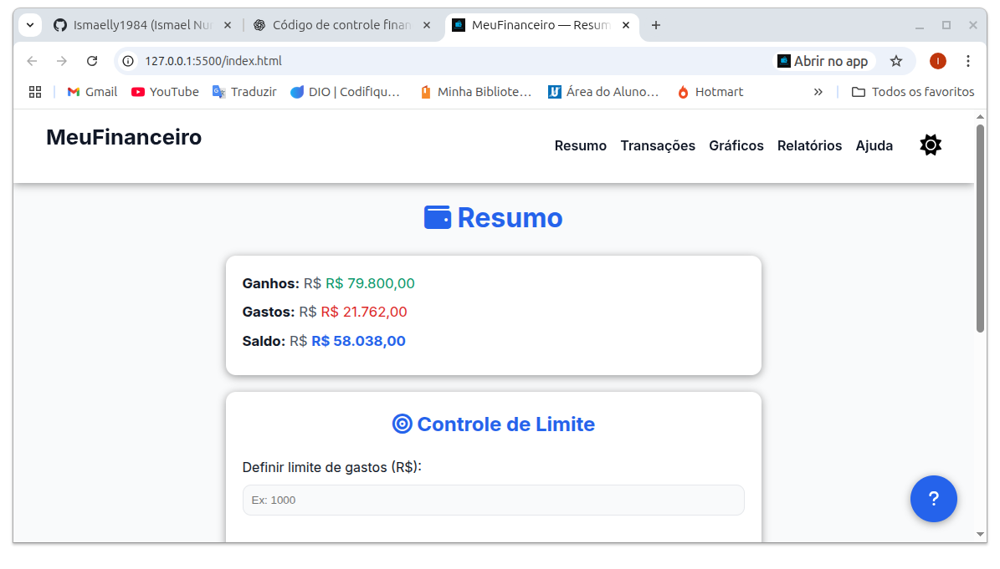
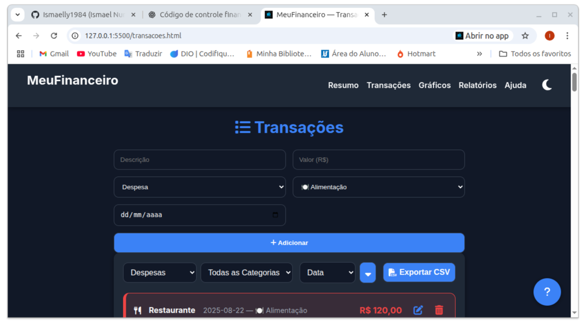

# 💰 MeuFinanceiro

[](./LICENSE.md)
[](https://github.com/Ismaelly1984/financeiro)
[](https://github.com/Ismaelly1984/financeiro/commits)
[](https://github.com/Ismaelly1984/financeiro/issues)
[](https://github.com/Ismaelly1984/financeiro/stargazers)

MeuFinanceiro é um PWA focado em controle financeiro pessoal. Ele roda 100% no navegador (LocalStorage), oferece visualizações ricas com gráficos e relatórios e funciona inclusive offline. Ideal para quem quer um painel simples, responsivo e instalável.

---

## 🧭 Sumário
- [Visão geral rápida](#-visão-geral-rápida)
- [Demo](#-demo)
- [Screenshots](#-screenshots)
- [Como executar](#-como-executar)
- [Páginas e fluxo](#-páginas-e-fluxo)
- [Dados, privacidade e segurança](#-dados-privacidade-e-segurança)
- [Contribuição](#-contribuição)
- [Changelog](#-changelog)
- [Licença](#-licença)
- [Contato](#-contato)

---

## ✨ Visão geral rápida
- Registro completo de transações (adicionar, editar, excluir) com filtros e ordenação persistentes.
- Painel resumo com saldo, totais e alerta visual para limites de gastos gerais e por categoria.
- Gráficos em Chart.js (pizza e linha) que respeitam o tema claro/escuro automaticamente.
- Relatórios exportáveis (CSV), filtro por período e agrupamentos dinâmicos.
- PWA instalável com suporte offline, página de ajuda detalhada e modo responsivo refinado (mobile-first).

---

## 📌 Demo
Deploy público planejado. Enquanto isso, rode localmente seguindo as etapas abaixo.

---

## 🖼️ Screenshots
Capturas reais ficam centralizadas em `./assets/screenshots/`. Substitua ou adicione novas conforme sua necessidade.




Dica: mantenha os arquivos em 1280×720 (ou 900×600) e otimize GIFs para ≤3 MB para garantir boa visualização no GitHub.

---

## 🚀 Como executar
```bash
# 1. Clone o repositório
git clone https://github.com/Ismaelly1984/financeiro.git

# 2. Entre na pasta
cd financeiro

# 3. Suba um servidor estático. Exemplos:
# npx serve .
# python -m http.server 5500
# live-server

# 4. Acesse (ajuste a porta conforme o comando escolhido)
http://localhost:5500
```

> Dica: por ser um PWA, abra em um navegador moderno para que o Service Worker seja registrado e o modo offline fique disponível.

### Instalar como PWA
1. Abra o app no Chrome, Edge ou Safari.  
2. Toque em **Adicionar à tela inicial** (mobile) ou **Instalar** (desktop).  
3. Aproveite a experiência em tela cheia.

---

## 🧩 Páginas e fluxo
- `index.html`: painel resumo, limite geral e orçamentos por categoria.  
- `pages/transacoes.html`: lista completa, filtros, ordenação e exportação CSV.  
- `pages/relatorios.html`: relatórios por período com gráficos e exportação dedicada.  
- `pages/graficos.html`: dashboards visuais focados em tendências.  
- `pages/help.html`: central de ajuda responsiva, com busca e FAQ.  
- `offline.html`: fallback exibido quando não há conexão.

Estrutura base:
```
assets/
  css/style.css           # Estilos globais + ajustes responsivos
js/
  app.js                  # Orquestra funcionalidades das páginas
  dom.js, finance.js ...  # Módulos responsáveis pela UI e regras de negócio
pages/                    # Páginas extras (transações, relatórios, ajuda, etc.)
manifest.json             # Manifesto PWA
service-worker.js         # Cache e suporte offline
```

---

## 🔐 Dados, privacidade e segurança
- Todos os dados ficam no LocalStorage do navegador — nada sai do seu dispositivo.  
- O arquivo [`PRIVACY.md`](./PRIVACY.md) detalha como as informações são tratadas.  
- Veja também [`SECURITY.md`](./SECURITY.md) para diretrizes de reporte responsável.  
- Para resetar tudo, limpe os dados do site no navegador ou use a funcionalidade de exportação para backup antes.

---

## 🤝 Contribuição
Quer colaborar? Fique à vontade para abrir issues ou PRs. Recomendações:
- Faça um fork, crie uma branch (`feature/<nome>` ou `fix/<nome>`) e só então abra o pull request.  
- Descreva claramente o problema/solução e inclua passos de teste quando possível.

Mais detalhes em [`CONTRIBUTING.md`](./CONTRIBUTING.md). Procurando algo fácil? Busque issues com a label `good first issue`.

---

## 📣 Changelog
Histórico de alterações disponível em [`CHANGELOG.md`](./CHANGELOG.md).

---

## ⚖️ Licença
Código distribuído sob a licença MIT. Leia o arquivo [`LICENSE.md`](./LICENSE.md).

---

## ✉️ Contato
Criado por **Ismael Nunes** — [@Ismaelly1984](https://github.com/Ismaelly1984)
