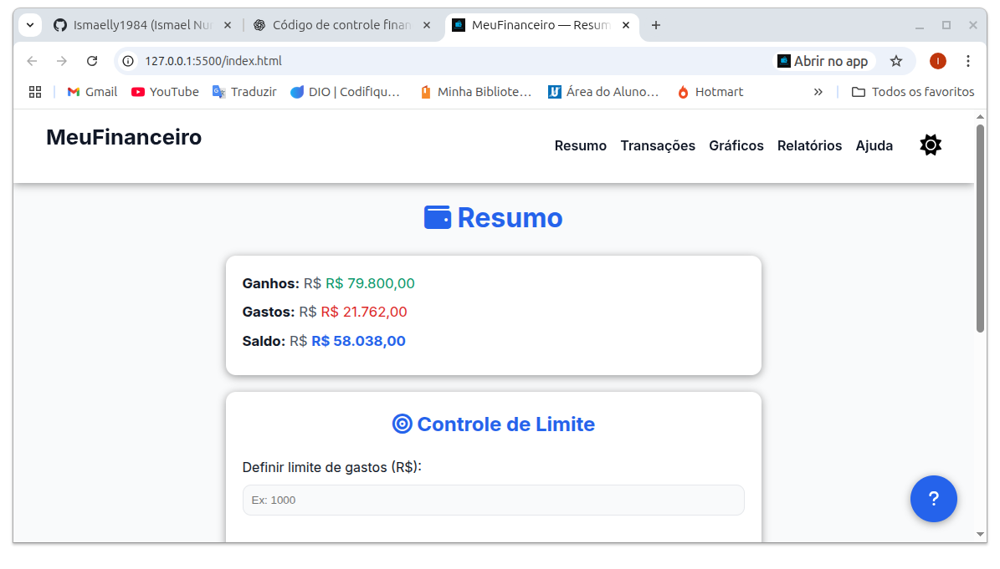
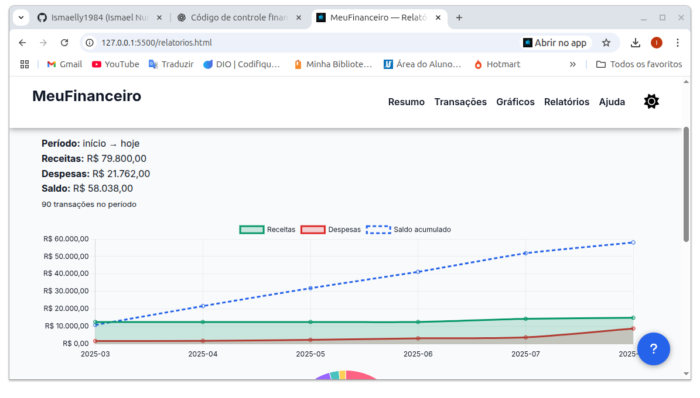

# 💰 MeuFinanceiro — Seu Controle de Gastos Inteligente (PWA)

[]()
[]()
[]()
[]()
[](./LICENSE)

---

**MeuFinanceiro** é um aplicativo de controle financeiro pessoal moderno, responsivo e offline (**PWA**), que permite gerenciar receitas, despesas, orçamentos e limites, com gráficos e relatórios detalhados.

**PWA Ready** • **Vanilla JS** • **Chart.js** • **License: MIT**

---

## 🚀 Funcionalidades

- 📊 **Painel Resumo** — Visão geral do saldo, receitas, despesas e orçamento.
- 📝 **Transações** — Cadastro de receitas e despesas com categorias personalizadas.
- 📈 **Gráficos Interativos** — Visualização dos dados de forma clara e dinâmica.
- 📑 **Relatórios** — Exportação de dados, filtros por período e impressão.
- 📱 **PWA (Progressive Web App)** — Funciona offline e pode ser instalado no dispositivo.
- 🎨 **Tema Escuro/Claro** — Alternância de tema para melhor experiência visual.
- 🧮 **Orçamento por Categoria** — Controle de gastos em cada área.

---

## 🖼️ Screenshots

### 📊 Resumo


### 📝 Transações


### 📑 Relatórios


---

## 🛠️ Tecnologias Utilizadas

- **HTML5**
- **CSS3**
- **JavaScript (Vanilla JS)**
- **Chart.js** — Gráficos interativos.
- **LocalStorage** — Armazenamento local de dados.
- **PWA** — Funcionalidade offline.

---

## 📦 Instalação

### 1. Clone o repositório
```bash
git clone https://github.com/seu-usuario/meu-financeiro.git
2. Acesse a pasta do projeto
bash
Copiar
Editar
cd meu-financeiro
3. Abra o arquivo index.html no navegador
Ou use um servidor local como:

bash
Copiar
Editar
npx serve
📲 Instalação como PWA
Abra o MeuFinanceiro no navegador.

Clique no ícone "Instalar" ou adicione à tela inicial.

Use o app como se fosse nativo, mesmo sem internet.

❓ Ajuda
Adicionar transação: Vá até a aba Transações, selecione se é receita ou despesa, preencha a categoria, valor e descrição, depois clique em Adicionar.

Definir orçamento: Na tela Resumo, configure o limite mensal e acompanhe o progresso no indicador.

Visualizar relatórios: Na aba Relatórios, escolha um intervalo de datas e clique em Pesquisar para filtrar as transações.

Ver gráficos: Acesse a aba Gráficos para analisar a distribuição e evolução dos seus gastos.

Alternar tema: Clique no ícone de tema para mudar entre modo claro e escuro.

Funcionamento offline: Depois de instalado como PWA, o aplicativo continua funcionando mesmo sem internet.

📝 Licença
Este projeto está licenciado sob a licença MIT - veja o arquivo LICENSE para mais detalhes.

📬 Contato
Autor: Ismael Nunes dos Santos

GitHub: Ismaelly1984

LinkedIn: Ismael Nunes

💙 Desenvolvido para facilitar o controle financeiro pessoal.